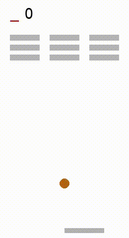
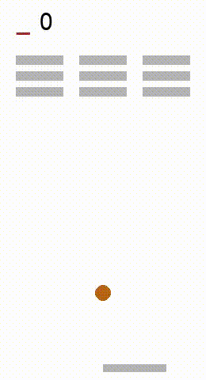
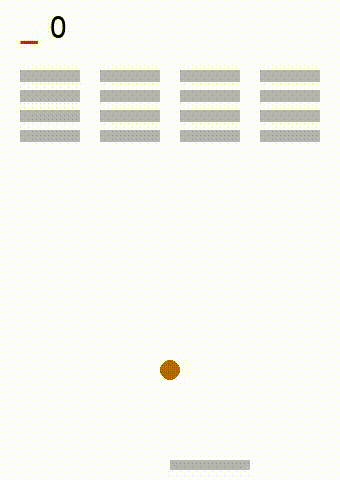
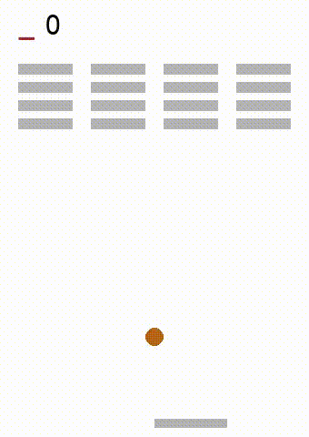
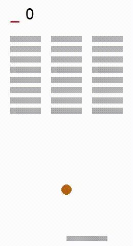
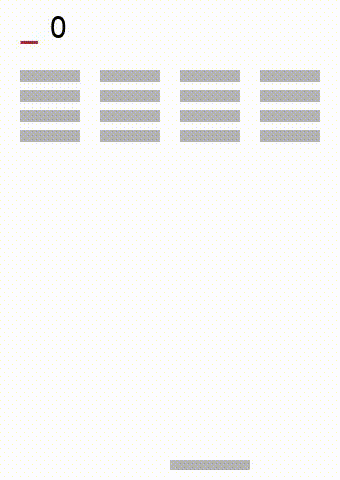
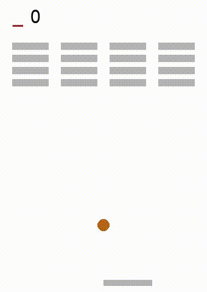

# Breakout 💥 Experiments
In the following there are all the results of the *experiments* made with the purpose of investigating and testinig further the techniques explained in "*Foundations for Restraining Bolt: Reinforcement Learning with LTLf/LDLf Restraining Specifications*" and in "*Imitation Learning over Heterogeneous Agents with Restraining Bolts*" papers. 

> The choosen environment is the **Breakout** game where the aim is to break all the present bricks. Thanks to ***restraining bolts*** (logical specifications which restrains agent behaviour in a custom manner), we can guide the way in which is possible to break the bricks. In these experiments it's shown how we can teach the breaking direction: both *left-to-right* ⏩⏩⏩ and *right-to-left* ⏪⏪⏪. We employed two different RL algorithms: ***Q-learning*** and ***SARSA***. In all the experiments is shown which one is used. 

To highlight strengths and weaknesses of the methods, we differentiated the experiments based on *bricks setting* (**3x3**, **4x4** and **8x3**) and on the *actions* the agent could use it (**only ball**⚾️  and **fire plus ball**🔥⚾️). We first tested the "plain" *restraining bolts* where the LTLf/LDLf specifications are already known in advance, and then, through a mechanism of *Imitation Learning*, *restraining bolts* where its logical specifications are learned by observing an *expert*. The expert agent in our case has a single state represantion and can only fire 🔥 (to make the learning of the optimal policy as simple as possible). The latest experiments show how the *learners* (agents which imitate expert's behaviour) behave conformly to the restraining bolt specifications without knowing them a priori.

## Restraining Bolts

### 3x3 bricks setting     🧱 🧱 🧱   🧱 🧱 🧱   🧱 🧱 🧱

#### ⚾️ BALL

  <figure style="text-align:center; flex:1;">
    
    <figcaption styles="text-align: center;"><b>Q-learning</b>   ⏪⏪⏪</figcaption>
  </figure>
  <figure style="text-align:center; flex:1;">
    
    <figcaption styles="text-align: center;"><b>SARSA</b>   ⏪⏪⏪</figcaption>
  </figure>
  <figure style="text-align:center; flex:1;">
    
    <figcaption styles="text-align: center;"><b>Q-learning</b>   ⏩⏩⏩</figcaption>
  </figure>
  <figure style="text-align:center; flex:1;">
    
    <figcaption styles="text-align: center;"><b>SARSA</b>   ⏩⏩⏩</figcaption>
  </figure>

__ __ __ __ __ __ __ __ __ __ __ __ __ __ __ __ __ __ __ __ __ __ __ __ __ __ __ __ __ __ __ __ __ __ __ __ __ __ __ __ __ __ __ 

#### 🔥⚾️ FIRE + BALL

  <figure style="text-align:center; flex:1;">
    
    <figcaption styles="text-align: center;"><b>Q-learning</b>   ⏪⏪⏪</figcaption>
  </figure>
  <figure style="text-align:center; flex:1;">
    
    <figcaption styles="text-align: center;"><b>SARSA</b>   ⏪⏪⏪</figcaption>
  </figure>
  <figure style="text-align:center; flex:1;">
    
    <figcaption styles="text-align: center;"><b>Q-learning</b>   ⏩⏩⏩</figcaption>
  </figure>
  <figure style="text-align:center; flex:1;">
    
    <figcaption styles="text-align: center;"><b>SARSA</b>   ⏩⏩⏩</figcaption>
  </figure>

___________________________________________________________________________________________________________

### 4x4 bricks setting     🧱 🧱 🧱 🧱   🧱 🧱 🧱 🧱   🧱 🧱 🧱 🧱   🧱 🧱 🧱 🧱

#### ⚾️ BALL

  <figure style="text-align:center; flex:1;">
    
    <figcaption styles="text-align: center;"><b>Q-learning</b>   ⏪⏪⏪</figcaption>
  </figure>
  <figure style="text-align:center; flex:1;">
    
    <figcaption styles="text-align: center;"><b>SARSA</b>   ⏪⏪⏪</figcaption>
  </figure>
  <figure style="text-align:center; flex:1;">
    
    <figcaption styles="text-align: center;"><b>Q-learning</b>   ⏩⏩⏩</figcaption>
  </figure>
  <figure style="text-align:center; flex:1;">
    
    <figcaption styles="text-align: center;"><b>SARSA</b>   ⏩⏩⏩</figcaption>
  </figure>

__ __ __ __ __ __ __ __ __ __ __ __ __ __ __ __ __ __ __ __ __ __ __ __ __ __ __ __ __ __ __ __ __ __ __ __ __ __ __ __ __ __ __ 

#### 🔥⚾️ FIRE + BALL

  <figure style="text-align:center; flex:1;">
    
    <figcaption styles="text-align: center;"><b>Q-learning</b>   ⏪⏪⏪</figcaption>
  </figure>
  <figure style="text-align:center; flex:1;">
    
    <figcaption styles="text-align: center;"><b>SARSA</b>   ⏪⏪⏪</figcaption>
  </figure>
  <figure style="text-align:center; flex:1;">
    
    <figcaption styles="text-align: center;"><b>Q-learning</b>   ⏩⏩⏩</figcaption>
  </figure>
  <figure style="text-align:center; flex:1;">
    
    <figcaption styles="text-align: center;"><b>SARSA</b>   ⏩⏩⏩</figcaption>
  </figure>

___________________________________________________________________________________________________________

### 8x3 bricks setting     🧱 🧱 🧱   🧱 🧱 🧱   🧱 🧱 🧱   🧱 🧱 🧱   🧱 🧱 🧱   🧱 🧱 🧱   🧱 🧱 🧱   🧱 🧱 🧱

  <figure style="text-align:center; flex:1;">
    
    <figcaption styles="text-align: center;"><b>SARSA</b>   ⏩⏩⏩   ⚾️</figcaption>
  </figure>
  <figure style="text-align:center; flex:1;">
    
    <figcaption styles="text-align: center;"><b>SARSA</b>   ⏩⏩⏩   🔥⚾️</figcaption>
  </figure>

___________________________________________________________________________________________________________

## Imitation Learning

### Expert 👨🏼‍🏫

  <figure style="text-align:center; flex:1;">
    
    <figcaption styles="text-align: center;"><b>SARSA</b>   ⏪⏪⏪   🔥 </figcaption>
  </figure>

__ __ __ __ __ __ __ __ __ __ __ __ __ __ __ __ __ __ __ __ __ __ __ __ __ __ __ __ __ __ __ __ __ __ __ __ __ __ __ __ __ __ __ 

### Learners 👨🏼‍🎓

  <figure style="text-align:center; flex:1;">
    
    <figcaption styles="text-align: center;"><b>SARSA</b>   ⏪⏪⏪   ⚾️   <b>3x3</b></figcaption>
  </figure>
  <figure style="text-align:center; flex:1;">
    
    <figcaption styles="text-align: center;"><b>SARSA</b>   ⏪⏪⏪   🔥⚾️   <b>3x3</b></figcaption>
  </figure>
  <figure style="text-align:center; flex:1;">
    
    <figcaption styles="text-align: center;"><b><b>SARSA</b>   ⏪⏪⏪   ⚾️   <b>4x4</b></figcaption>
  </figure>
  <figure style="text-align:center; flex:1;">
    
    <figcaption styles="text-align: center;"><b>SARSA</b>   ⏪⏪⏪   🔥⚾️   <b>4x4</b></figcaption>
  </figure>

___________________________________________________________________________________________________________